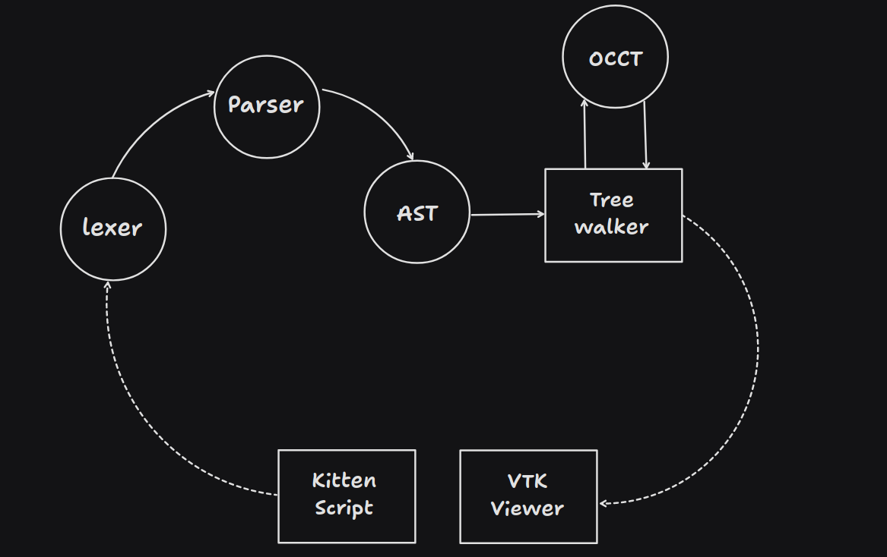

# OpenKittenCAD

My hobby project Code CAD program. 


## High Level Overview



## Dependencies 
I am a true believer that for a project to be 
maintainable in the long term we have to keep
as little dependancies as possible. This project
depends on the following dependancies 

- Flex
- Bison
- OpenCascade
- VTK (Soon to be removed as a dependent)

> :warning: **Note**: Not listing any of the dependancies dependances!


## Grammar
```txt
#---------------------------------------
# Statements
#---------------------------------------

stmt      : block
          | functionStmt
          | declStmt
          | exprStmt
          | returnStmt


stmtList  : stmtList ';' stmt
          | stmt

#---------------------------------------

functionStmt    : 'fn' ID '(' paramDeclList ')' [ '->' TYPE ]? block

returnStmt      : 'return' expr

declStmt        :  ID ':' TYPE initOpt

exprStmt        : expr

block           : '{' stmtList* '}'

paramDeclList   : empty
                | paramDeclList ',' paramDecl
                | paramDecl

paramDecl       : ID ':' TYPE

initOpt         : [ ':=' expr ]?


#---------------------------------------
# Expressions
#---------------------------------------


expr            : expr binaryOpr expr
                | NUM 
                | TRANS 
                | ID 
                | ID '(' argList ')'

argList         : empty
                | argList ',' '%'
                | argList ',' expr
                | expr 
                | '%'
    


# Binary operators :
#   Pipe          : '|>'
#   Math          : '+' '-' '*' '/' 
```
