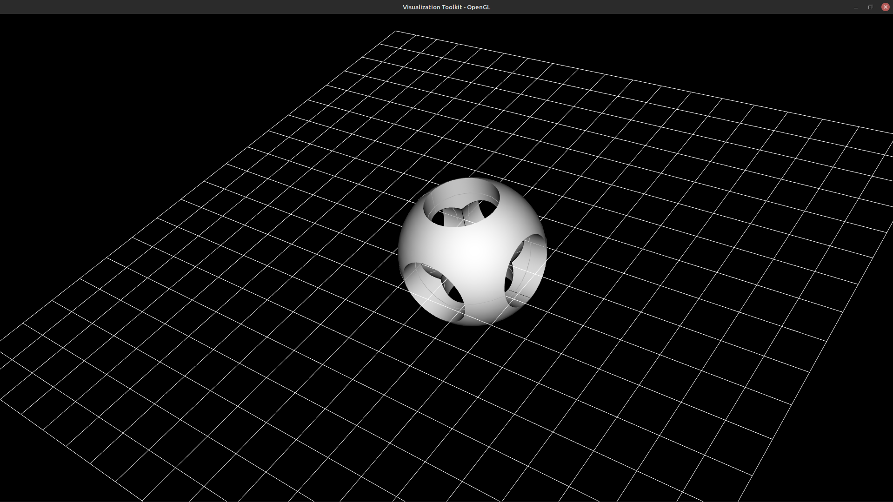

# Examples

### Example One
```rust
fn degToRad(degrees: number) -> number {
    return degrees * 3.14 / 180;
};


{
    let mySphere: shape := sphere(2);   

    let myCylOne: shape := cylinder(1, 2);
    let myCylThree: shape := rotate(myCylOne,  degToRad(90), rotY);
    let myCylFour: shape := myCylOne |> rotate(%, degToRad(90), rotX);

    let superUnion: shape := union(
        myCylOne |> rotate(%, degToRad(180), rotX),
        union(
            myCylOne,
            union(
                union(myCylThree, rotate(myCylOne,  -degToRad(90), rotX)),
                union(myCylFour, rotate(myCylOne,  -degToRad(90), rotY))
            )
        )
    );


    addShape(difference(mySphere, superUnion));
}
```


