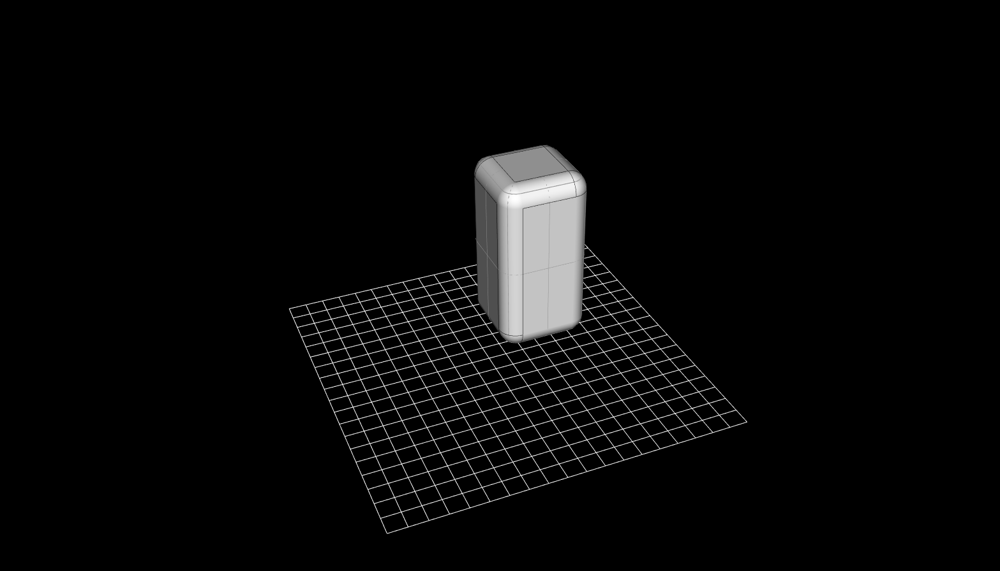

# Examples

### Example One
```rust
fn degToRad(degrees: number) -> number {
    return degrees * 3.14 / 180;
};


{
    let mySphere: shape := sphere(2);   

    let myCylOne: shape := cylinder(1, 2);
    let myCylThree: shape := rotate(myCylOne,  [0, degToRad(90), 0]);
    let myCylFour: shape := myCylOne |> rotate(%, [degToRad(90), 0, 0]);

    let superUnion: shape := union(
        myCylOne |> rotate(%, [degToRad(180), 0, 0]),
        union(
            myCylOne,
            union(
                union(myCylThree, rotate(myCylOne,  [-degToRad(90), 0, 0])),
                union(myCylFour, rotate(myCylOne,  [0, -degToRad(90), 0]))
            )
        )
    );

    addShape(difference(mySphere, superUnion));
};
```


```rust
const customFace: shape := [0, 0, 0]
                     |> lineTo(%, [5, 0, 0])
                     |> lineTo(%, [5, 5, 0])
                     |> lineTo(%, [0, 5, 0])
                     |> lineTo(%, [0, 0, 0])
                     |> makeFace(%)
                     |> extrude(%, [0, 0, 10])
                     |> fillet(%, 1);
                     

addShape(customFace);
```



